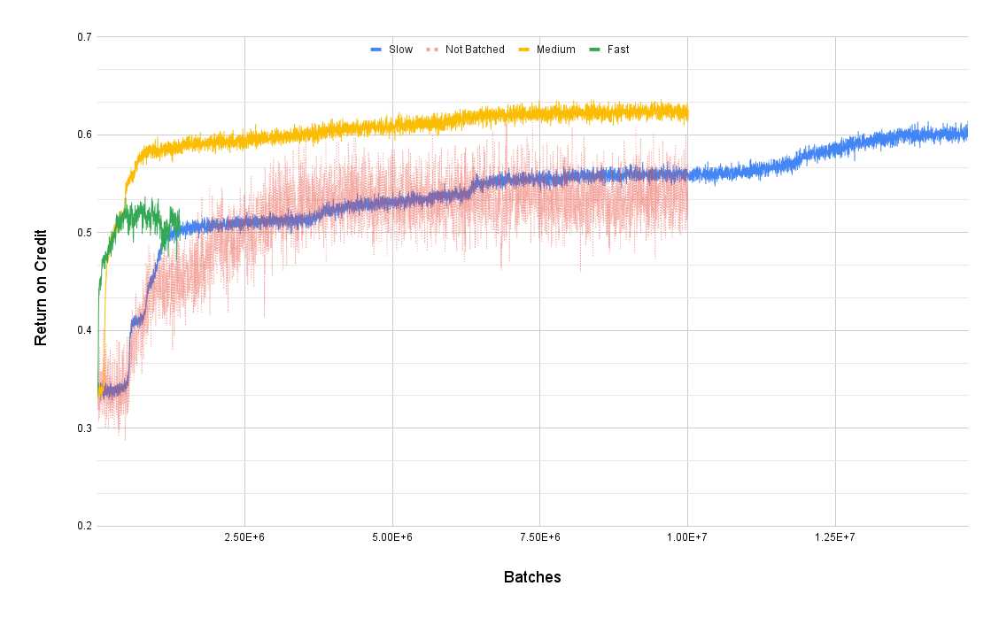

# RL From Scratch

[Presentation Slides](https://docs.google.com/presentation/d/1IUyrTFRdHuy7-9HdpjYNgKBUNqm9e63cofNO57oQLZE/edit?pli=1)

## Goals

The primary goal of the project is to learn by exploring different model architectures and techniques within RL. To have something to work towards, I'm setting an initial goal of 0.7 average return on credit, which is about half way between random (0.34) and optimal (~0.99) play.

Even discouting straights entirely would allow the model to achieve ~0.9 RoC, so I believe 0.7 is a reasonable initial target.

### Predicitons
* I expect the model to quickly identify most pairs/tips/quads as good to keep, but struggle to learn straights.
EV w/o straights ~0.94 according to online calc
* I also expect Royal Flushes to be rare enough that the model won’t effectively learn them. Straight flushes to a lesser extent since the model may run into them when going for flushes.
* Specific optimal strategies I expect it to struggle with:
    * 4 to Royal (18.3617) > Dealt Flush (6.0)
    * 4 to Straight Flush (3.5319) > High Pair (1.5365) > 4 to a Flush (1.2766)
    * 4 to Outside Straight (0.6809) > Hold 1 or 2 High Cards (~0.48)

## Progress

This section includes discussion performance of different model architectures and techniques used to improve the RoC. Charts show the average RoC over the entire training duration in blue and the "recent" average score (past 1000 hands) in red.

### First Attempt

Architecture:
* 85 One-Hot Input
* 170 ReLU Layer
* 170 ReLU Layer
* 5 Sigmoid Output
* No Baseline

This model did not show any improvment over the duration of training, with average RoC hovering around 0.34. It's very likely that the independent decisions for each hold/discard decision meant that the model couldn't deduce a consistent signal.

### First Learning Net!

Architecture:
* 85 One-Hot Input
* 170 ReLU Layer
* 170 Sigmoid Layer
* 32 Softmax Output
* Running Average Baseline

Since hold/discard decisions should be made based on the entire hand, not independently per card, I replaced the final layer with 32 outputs representing all of the different discard patterns (2^5).

I also added a baseline related to the running average of RoC up to that point since previously the model received no signal (i.e. reward was 0 so gradient was 0) when throwing away a good hand.

This was enough to see a small gain in performance over time! The ending RoC was ~0.41 compared to ~0.34 for random play.

-170(Sig)-32(Soft),%20Running%20Average%20Baseline,%20Score%20Over%20Time.png)
[Raw Data w/ Gradients](https://docs.google.com/spreadsheets/d/1hgVxpTN4HSozA5atwxwJeUB12rAeBXeNlqrY5FWYnmc/edit?gid=588975011#gid=588975011)

### Actor-Critic Model

Architecture:
* 85 One-Hot Input
* 170 ReLU Layer
* 170 ReLU Layer
* 32 Softmax Output
* Critic Model Baseline
    * 85 One-Hot Input
    * 85 ReLU Layer
    * 1 Linear Output

Not all hands are worth the same value (e.g. dealt 3-of-a-kind is worth much more than dealt no high cards), but the running average baseline has no way of accounting for this. As a result, the model has little incentive to learn to hold high value hands. For example, getting dealt 4-of-a-kind and discarding 2 would still be rewarded since the pair is worth more than the average baseline.

To account for this, we train a second model to predict the value of the hand and use it's output as the baseline (the Critic in the Actor-Critic architecture). The critic tries to predict the value of the hand based on the **current** actor policy so when the decision made appears to be better than the current policy, it is reinforced.

This further imporved RoC to ~0.48 for a while. However, as evidenced by the chart, the policy remains very sensitive to the large reward signal provided by the Royal Flush. This particular training sequence hit a streak of huge rewards signals which fully destroyed the policy.

-170(Sig)-32(Soft),%20Critic%20Network%20Baseline,%20Score%20Over%20Time.png)
[Raw Data w/ Gradients](https://docs.google.com/spreadsheets/d/1j_1QpUa8SVRHx2bL5Kh3pwB7eZNJ_zFBZtb3u2vzCMM/edit?gid=1049217317#gid=1049217317)

#### Disabling Royal Flushes (Proof of Concept)

Same architecture, however royal flushes are rewarded as straight flushes for a more consistent reward signal. I consider this cheating (since we are changing the environment instead of the model) so will eventually replace this with other techniques to make the signal more stable (mini-batching and starting out with a logrithmic reweard signal).

This provided a much more stable reward signal and allowed the model to break the ~0.5 RoC barrier, ending around ~0.53-- a promising sign for further reward signal optimizations.

-170(Sig)-32(Soft),%20Critic%20Network%20Baseline,%20Score%20Over%20Time%20(Disabled%20Royal%20Flush).png)
[Raw Data w/ Gradients](https://docs.google.com/spreadsheets/d/1bjb3qHKBfUTXn8QfzdyFB1FvXzHEB-JoWbKcmvbBGQA/edit?gid=767602707#gid=767602707)

#### Mini-Batching

To provide a more stable training signal to the model, we can run multiple iterations at the current policy and average all of the resultant gradients before making an update to the model. This technique is called mini-batching and also gives us a natural place to parallelize the training process (many workers running backpropagation at the same time). It also allows us to increase the training rate since the updates should be closer to the "true" gradient.

The following graph compares a model making batched updates with different learning rates against the previous 1 example per update model. Royal flushes are still disabled for now. The goal of this step is to check how the larger batch size affects the optimal learning rate.

|Config|Actor Learning Rate|Critic Learning Rate|Batch Size|Comments|
|---|---|---|---|---|
|Not Batched|0.002|0.003|1|Same as Before|
|Slow|0.002|0.003|32|Same as Non-Batched|
|Medium|0.01|0.015|32||
|Fast|0.064|0.096|32|Linear Scaling Rule|

[Raw Data w/ Gradients](https://docs.google.com/spreadsheets/d/1EorHLowmUdgoqkkb9dlHFj2QPbyIkK0py8ujFtGrWtY/edit?gid=0#gid=0)

Standard guidance seems to indicate that the learning rate should scale linearly with the batch size, however as can be seen in the chart this appears to be too high for the current model architecture. The warm-up period is much faster, however it appears to get stuck in a local minimum quickly and even shows signs of regressing.

The slow learning rate (i.e. unchanged from the non-batched version) shows similar, although slightly better, performance as the non-batched version. It is a little quicker to find a basic working policy and settles on a policy that has a higher RoC than the non-batched version. It also appears to keep learning even after 10M iterations, eventually breaking through 0.58 RoC.

The happy medium learning rate saw by far the best performance yet. It was very quick to learn the basic policy and was already pushing 0.6 RoC after ~2.5M iterations whereas the non-batched version was still at 0.5 RoC. By the end of training, the RoC of the policy was ~0.62-- a new record.

It should be noted that the batching is not fully parallelized on my machine, and has an increased cost to aggregate all of the gradients. So # of batches should not be viewed as a comparison of wall-clock training time, just a # of updates to the model.

### Up Next

* Epsilon-Greedy Annealing to promote exploration
* Stabilizing reward signals
* Experimenting with Wider/Deeper Networks
* Experience Replay Buffer to capture "surprising" training examples.